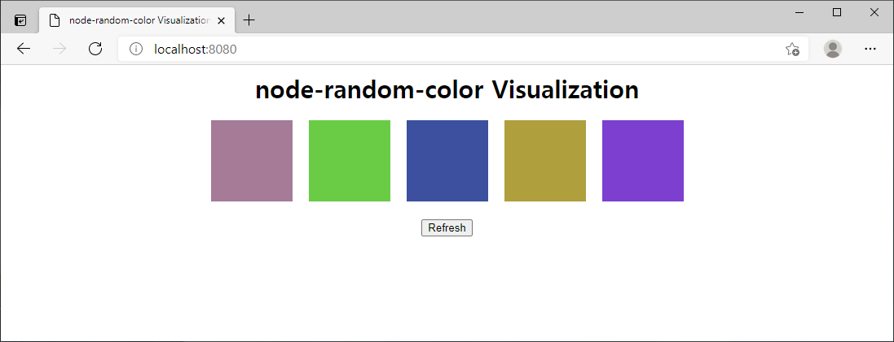

# Random Color Generator

`node-random-color` is a package that can be used to easily generate colors.

Options are available to make the generated colors dissimilar.

* [npm](https://www.npmjs.com/package/node-random-color)
* [GitHub](https://github.com/rulyox/node-random-color)

## Installation

```shell script
npm install node-random-color
```

## Example

### Usage

```javascript
const randomColor = require('node-random-color');

console.log('Generate 5 random colors');

for(let i = 0; i < 5; i++) {

    const color = randomColor({
        difference: 150,
        considerations: 5
    });

    console.log(color);

}
```

### Result

```
Generate 5 random colors
#A57B98
#6ACB45
#3C509F
#AF9F3D
#7C3fD0
```

### Visualization



## Options

* `difference` : Minimum difference from previous colors. If larger, more different colors will be generated. *(optional) (default is 150)* 
* `considerations` : The number of previous colors to consider. *(optional) (default is 5)*
* If `difference` and `considerations` are both too high, it might not be able to generate colors.
